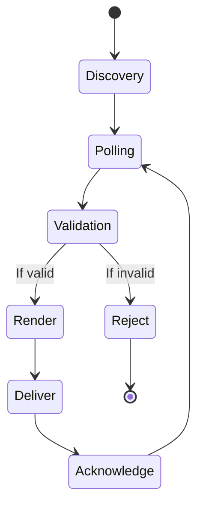
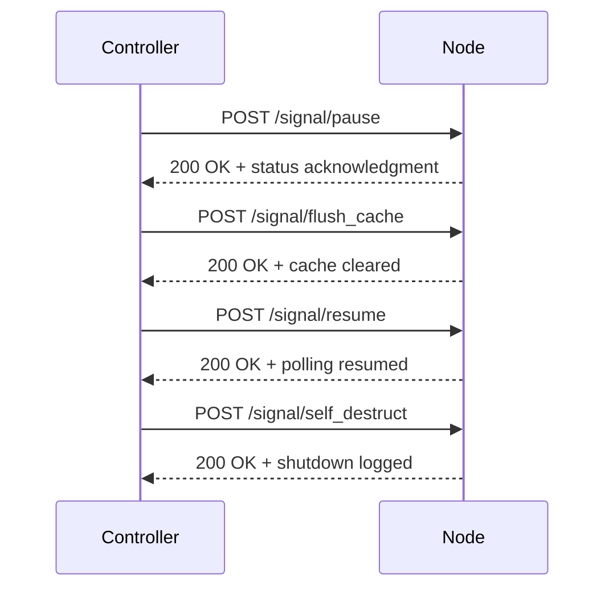

# 🧠 NODE_BEHAVIOR.md  
_DARF Node Runtime Behavior Specification_

**Behavior Version**: 1.0  
_Last updated: JUNE 29, 2025_

---

## 🚦 Execution Lifecycle

Each DARF node follows this loop after activation:

1. **Discovery:** Connect to controller and receive capabilities check  
2. **Polling:** Request next available job based on priority  
3. **Validation:** Check payload structure and resource availability  
4. **Render:** Perform layer-based composition as instructed  
5. **Deliver:** Submit final output to the `return_path`  
6. **Acknowledge:** Notify controller of completion or error

---

## 🔁 Job Retry Logic

If rendering fails:

- Nodes attempt **up to 3 retries** per payload  
- Backoff interval increases linearly (default: 5s, 10s, 15s)  
- After retries, job is marked `FAILED` and sent upstream for review

Controller may override default retry values via metadata fields.

---

## 🔒 Runtime Restrictions

Nodes are sandboxed from:

- Modifying payload contents  
- Accessing the internet beyond controller and return path  
- Altering render output filenames or directory structure

Any deviation triggers rejection and local quarantine.

---

## 📬 Controller Signals

Nodes recognize and respond to:

| Signal Name       | Action Performed                 |
|-------------------|----------------------------------|
| `pause`           | Halt polling, finish active job  |
| `resume`          | Resume polling from controller   |
| `flush_cache`     | Clear local payload queue        |
| `self_destruct`   | Terminate app and log exit       |

Signals are authenticated—untrusted signals are discarded.

---

## 📉 Error Reporting

Each node reports errors using a structured packet:

```json
{
  "frame_id": "frame_001",
  "error_code": "E_RENDER_TIMEOUT",
  "details": "Render exceeded max_render_time_ms",
  "timestamp": "2025-07-01T12:34:56Z"
}
```

Payloads are sent to the controller’s diagnostics endpoint for triage.

## 📌 Notes

- Nodes should assume **no persistent state** across reboots  
- Controllers may implement per-frame throttling based on node heat or battery telemetry  
- All behavior is versioned and must be validated before live deployment
```

## 🔄 Runtime State Diagram



## 📡 Controller ↔ Node Signal Flow



## 📊 Diagrams
These diagrams illustrate key runtime behaviors and controller interactions.

### 🔄 Node Execution Lifecycle


## 📡 Controller ↔ Node Signal Flow


